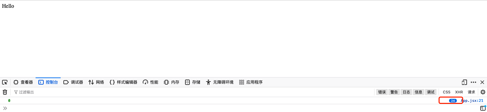

## pure function and impure function

>函数与外界交流数据只有一个唯一渠道:
>参数和返回值。


纯函数（Pure function）:返回结果只依赖于它的参数，而且没有任何可观察的副作用;

- 给纯函数传入相同的参数，永远会返回相同的值。如果返回值依赖外部变量，则不是纯函数。

```javascript
//pure function
//纯函数  不管外部如何天翻地覆，只要传入的参数是确定的，那么值永远是可预料的
function purefuncA(a,b){
  return a+b
}
purefuncA(1,5)//6

//// 非纯函数  返回值也依赖外部变量c，结果无法预料
//impure function
let c = 3;
const funcA = (a,b)=>{
  return a+b+c
}

funcA(2,4)//9
let c = 5;

funcA(2,4)//11
```
- 一个函数在执行过程中产生了外部可观察的变化，则这个函数是有副作用(Side Effect)的。
>通俗点就是函数内部做了和运算返回值无关的事，比如修改外部作用域/全局变量、修改传入的参数、发送请求、console.log、手动修改 DOM 都属于副作用。


纯函数很严格，几乎除了计算数据什么都不能干，计算的时候还不能依赖自身参数以外的数据。


>小结:
>满足纯函数就是要满足两点:<br>
>1.函数返回结果只依赖它的参数。<br>
>2.函数执行过程中不会对外产生可观察的变化。<br>


## 闭包陷阱问题(Closure trap)
Look at the code below:
```jsx
import { useEffect, useState } from 'react';

function App() {

    const [count,setCount] = useState(0);

    useEffect(() => {
        setInterval(() => {
            setCount(count + 1);
        }, 500);
    }, []);

    useEffect(() => {
        setInterval(() => {
            console.log(count);
        }, 500);
    }, []);

    return <div>Hello</div>;
}

export default App;

```

用 useState 创建了个 count 状态，在一个 useEffect 里定时修改它，另一个 useEffect 里定时打印最新的 count 值。

running:



打印的并不是我们预期的 0、1、2、3，而是 0、0、0、0，这是为什么呢？

这就是所谓的闭包陷阱。

通过查看底层源码得知:
`areHookInputsEqual(nextDeps,preDeps)`这个函数会比较前后的deps,
如果是空数组,导致areHookInputsEqual(nextDeps,preDeps)这个函数返回值为FALSE;
导致不执行回调函数,此时只执行一次回调;这又会导致什么?

useEffect 等 hook 里用到了某个 state，但是没有加到 deps 数组里，这样导致 state 变了却没有执行新传入的函数，依然引用的之前的 state(为什么引用的是之前的state见上)。

## Fix
闭包陷阱的解决也很简单，正确设置 deps 数组就可以了，这样每次用到的 state 变了就会执行新函数，引用新的 state。不过还要注意要清理下上次的定时器、事件监听器等。


```jsx
import { useEffect, useState } from 'react';

function Dong() {

    const [count,setCount] = useState(0);

    useEffect(() => {
        const timer = setInterval(() => {
            setCount(count + 1);
        }, 500);
        return () => clearInterval(timer);
    }, [count]);

    useEffect(() => {
        const timer = setInterval(() => {
            console.log(count);
        }, 500);
        return () => clearInterval(timer);
    }, [count]);

    return <div>guang</div>;
}

export default Dong;
```

## useEffect的执行顺序
```jsx

function Child() {
  useEffect(() => {
    console.log('child');
  }, [])

  return <p>hello</p>;
}

function Parent() {
  useEffect(() => {
    console.log('parent');
  }, [])

  return <Child/>;
}

function App() {
  useEffect(() => {
    console.log('app');
  }, [])

  return <Parent/>;
}
```
渲染<App/>时控制台的打印顺序是？
```
👉                              child -> parent -> app

```
why?

React的源码可以拆分为三块：

- 调度器：调度更新
- 协调器：决定更新的内容
- 渲染器：将更新的内容渲染到视图中


其中，只有`渲染器`会执行渲染视图操作。

对于浏览器环境来说，只有`渲染器`会执行类似`appendChild`、`insertBefore`这样的DOM操作。

`协调器`如何决定更新的内容呢？

答案是：他会为需要更新的内容对应的`fiber`（可以理解为`虚拟DOM）打上标记。

这些被打标记的`fiber`会形成一条链表`effectList`。

`渲染器`会遍历`effectList`，执行标记对应的操作。

比如`Placement`标记对应插入`DOM`

比如`Update`标记对应更新DOM属性

`useEffect`也遵循同样的工作原理：

- 触发更新时，`FunctionComponent`被执行，执行到`useEffect`时会判断他的第二个参数`deps`是否有变化。

- 如果`dep`s变化，则`useEffect`对应`FunctionComponent`的`fiber`会被打上`Passive`（即：需要执行`useEffect`）的标记。

- 在渲染器中，遍历`effectList`过程中遍历到该fiber时，发现`Passive`标记，则依次执行该`useEffect`的`destroy`（即useEffect回调函数的返回值函数）与create（即useEffect回调函数）。

其中，前两步发生在协调器中。

所以，`effectList`构建的顺序就是useEffect的执行顺序。

### effectList
`协调器`的工作流程是使用遍历实现的`递归`。所以可以分为`递`与`归`两个阶段。

我们知道，`递`是从根节点向下一直到叶子节点，`归`是从叶子节点一路向上到根节点。

>`effectList`的构建发生在归阶段。所以，`effectList`的顺序也是从叶子节点一路向上。

`useEffect`对应`fiber`作为`effectList`中的一个节点，他的调用逻辑也遵循归的流程。

现在，我们有充足的知识回答第一个问题：

由于归阶段是从`Child`到`Parent`到`App`，所以相应`effectList`也是同样的顺序。

所以`useEffect`回调函数执行也是同样的顺序。


### 渲染
`React`的执行遵循：
```
调度 -- 协调 -- 渲染

```
渲染相关工作原理是按照：

```
构建effectList -- 遍历effectList执行对应操作


```

`effectList`会在渲染器中被处理。

对于`useEffect`来说，遍历`effectList`时，会找到的所有包含`Passive`标记的`fiber`。

依次执行对应`useEffect的destroy`。

所有`destroy`执行完后，再依次执行所有`create`。

整个过程是在页面渲染后异步执行的。

看一个问题:
```jsx
// componentDidMount生命周期钩子
class App extends React.Component {
  componentDidMount() {
    console.log('hello');
  }
}

// 依赖为[]的useEffect
useEffect(() => {
  console.log('hello');
}, [])
```
两个回调函数的调用时机相同么?
如果`useEffect的deps`为`[]`，由于`deps`不会改变，对应`fiber`只会在`mount`时被标记`Passive`。

这点是类似componentDidMount的。


但是，处理`Passive effect`是在渲染完成后异步执行，而`componentDidMount`是在渲染完成后同步执行，所以他们是不同的。


## 参考

https://mp.weixin.qq.com/s/0P7eWSNQNKWroDIlcgHBVw

https://mp.weixin.qq.com/s/a25xf4AEwJXT7Ubvo6AL6g

https://overreacted.io/zh-hans/a-complete-guide-to-useeffect/